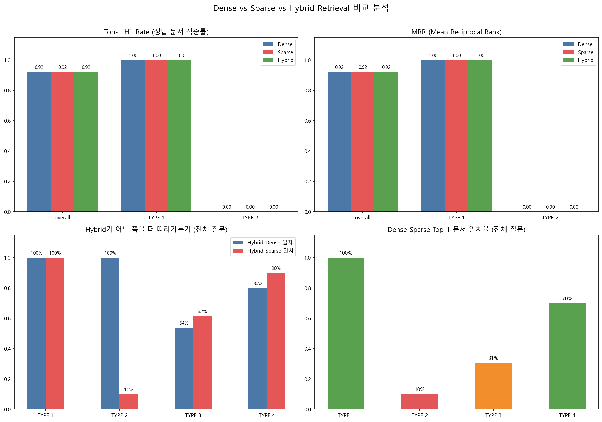

# Part 04 — RAG 고도화: Dense / Sparse / Hybrid Retrieval 분석 보고서

> **담당:** 건호
> **작성일:** 2026-04-15
> **담당 범위:** ① 질문 샘플 기반 분석 (45문항, 타 팀원이 사전 생성한 데이터셋 활용) ② 질문 유형 태깅 ③ Dense/Sparse/Hybrid 비교표 ④ 질문 유형별 해석 ⑤ 개선 아이디어 2개 제안

---

## 0. 개요 (Executive Summary)

본 보고서는 RAG 파이프라인의 **Retrieval 단계**에서 세 가지 방식 — Dense (의미 기반), Sparse (키워드 기반), Hybrid (RRF 결합) — 의 성능과 경향을 비교 분석한 결과를 정리한다.

### 핵심 결론

| # | 발견 | 근거 |
|---|---|---|
| 1 | **고유명사 질문(TYPE 1)** 은 3종 방식 모두 완벽히 해결 | Top-1 Hit Rate 1.00 (12/12) |
| 2 | **Sparse는 특정 문서 편향** 존재 (TYPE 2에서 10문항 중 4개 고려대학교로 쏠림) | 고려대 RFP 458 chunk outlier (Q15·Q16·Q17·Q20 실측) |
| 3 | **Dense는 추상 질문에서 drift** (의미 일반화로 기관명 혼동) | Q23: 국민연금공단 이러닝 → 한국농수산식품유통공사 |
| 4 | **Hybrid는 safe-fallback** 역할 — 상황별로 Dense·Sparse 역할 자동 분담 | TYPE 2 Hybrid-Dense 100% / TYPE 4 Hybrid-Sparse 90% |
| 5 | **개선 아이디어 2개** 도출 — RRF 가중치 기반 Hybrid (적용 완료) + BM25 b 파라미터 튜닝 (제안) | 본문 §5 참조 |

---

## 1. 실험 설정

### 1-1. 데이터

| 항목 | 값 |
|---|---|
| 문서 코퍼스 | 100개 RFP (b02_prefix_v2_chunks.jsonl) |
| 총 chunk 수 | 5,948 |
| 전처리 | prefix_v2 (문서명 + 기관명 + 프로젝트 요약 prefix 부착) |
| 평가 질문 | 45개 (TYPE 1~4) — *타 팀원이 사전 생성한 데이터셋 활용* |
| Ground truth 라벨 | 13개 (TYPE 1:12, TYPE 2:1, TYPE 3:0, TYPE 4:0) |

### 1-2. 검색 방식

| 방식 | 구성 |
|---|---|
| **Dense** | OpenAI `text-embedding-3-small` + numpy cosine similarity |
| **Sparse** | BM25Okapi (rank_bm25) + 한국어 토큰화, 기본 `b=0.75`, `k1=1.5` |
| **Hybrid** | RRF (Reciprocal Rank Fusion), Dense 가중치 0.7 + Sparse 가중치 0.3, `rrf_k=60` |

**RRF 공식**
```
score(doc) = 0.7 × 1/(60 + rank_dense) + 0.3 × 1/(60 + rank_sparse)
```

**직관적 해석 (왜 이렇게 설계했나)**

- **순위가 역수인 이유:** 1위(1/61)와 2위(1/62)의 차이는 작지만, 1위(1/61)와 50위(1/110)의 차이는 크다. 즉 **상위권 순위 변동에 민감, 하위권은 둔감** 하게 반응하도록 설계된 결합 방식.
- **`rrf_k=60` 값을 사용한 이유:** 분모에 상수 60을 더해 "1위와 2위 점수 차이가 지나치게 벌어지는 것"을 완충. 너무 작으면 1위가 압도적이 되어 결합 의미가 없고, 너무 크면 순위 차이가 희석됨. 60은 경험적 표준값.
- **Dense 0.7 : Sparse 0.3로 설정한 이유:** 한국어 RFP 도메인에서 Dense 임베딩이 문맥·의미 파악에 더 강하다는 가정. 0.5:0.5 로 두면 Sparse의 문서 길이 편향(§4-2 참조)이 과도하게 반영될 위험. 본 프로젝트에서는 0.7:0.3 고정값으로 시작했으며, 스윕 튜닝은 future work.

### 1-3. 평가 지표

| 지표 | 의미 |
|---|---|
| **Top-1 Hit Rate** | Top-1 문서가 정답과 일치한 비율 (1순위 적중률) |
| **MRR@5** | 상위 5개 중 정답 문서의 역순위 평균 |
| **일치율 (D-S, H-D, H-S)** | 두 방식의 Top-1 문서가 동일한 비율 (경향성 지표) |

**직관적 해석 (지표가 무엇을 뜻하는지)**

- **Top-1 Hit Rate = "사용자가 1순위만 클릭한다는 가정 하의 정답률"**
  - 0.92 → 100명이 검색하면 92명은 최상위 결과에서 정답을 얻음
  - 이 지표가 0인 TYPE 2 → 1순위만 봐서는 답을 얻을 수 없는 상태
- **MRR = "정답이 상위권에 얼마나 가까이 있는가"**
  - 정답이 1위면 1.00, 2위면 0.50, 3위면 0.33, 5위면 0.20
  - Top-1 Hit Rate 보다 관대한 지표 — "5개 중에는 있다"를 반영
- **일치율 = "성능이 아니라 성향 지표"**
  - 두 방식이 **같은 답을 고르는 비율**. 정답이 뭔지와 무관하게 동작 성향만 비교.
  - 용도: GT가 없어도 "Hybrid가 Dense/Sparse 중 어느 쪽을 더 따라가는가" 를 측정 가능 (TYPE 3·4에서 핵심적으로 활용).

---

## 2. 질문 유형 태깅 (TYPE 1~4)

> **출처:** 예시 질문은 모두 `dense_sparse_results/dense_sparse_hybrid_per_question.csv` 의 실제 평가 질문 원문이다.

| TYPE | 정의 | 질문 수 | GT 수 | 실제 예시 (Q#) |
|---|---|---|---|---|
| **TYPE 1** | 고유명사 직접 질의 (기관명·사업명 명시) | 12 | 12 | Q01: "국민연금공단이 발주한 2024년 이러닝시스템 운영 용역의 사업 예산은 얼마야?" |
| **TYPE 2** | 비교·다중 문서 질의 (여러 문서 참조 필요, 단일 기관 다중 사업 포함) | 10 | 1 | Q13: "고려대학교 차세대 포털·학사 정보시스템 사업이랑 광주과학기술원 학사시스템 기능개선 사업을 (비교해줘)" |
| **TYPE 3** | 추상·후속 개념 질의 (도메인 일반 용어·맥락 의존) | 13 | 0 | Q24: "콘텐츠 개발 관리 요구사항에 대해서 더 자세히 알려줘." |
| **TYPE 4** | 답변 불가·범위 외 질의 (존재하지 않는 정보) | 10 | 0 | Q41: "광주과학기술원 학사시스템 사업을 수주한 업체 이름이 뭐야?" |

---

## 3. Dense / Sparse / Hybrid 비교표 (핵심 결과)

### 3-1. 전체 요약

| 그룹 | 질문 수 | 평가 가능 | Dense Hit | Sparse Hit | Hybrid Hit | Dense MRR | Sparse MRR | Hybrid MRR |
|---|---|---|---|---|---|---|---|---|
| **전체** | 45 | 13 | **0.9231** | **0.9231** | **0.9231** | 0.9231 | 0.9231 | 0.9231 |
| TYPE 1 | 12 | 12 | 1.0000 | 1.0000 | 1.0000 | 1.0000 | 1.0000 | 1.0000 |
| TYPE 2 | 10 | 1 | 0.0000 | 0.0000 | 0.0000 | 0.0000 | 0.0000 | 0.0000 |
| TYPE 3 | 13 | 0 | – | – | – | – | – | – |
| TYPE 4 | 10 | 0 | – | – | – | – | – | – |

> "Hit" = Top-1 Hit Rate (1순위 적중률)

**💡 Top-1 Hit Rate = MRR 인 이유**

표에서 overall(0.9231), TYPE 1(1.0000), TYPE 2(0.0000) 모두 **Hit Rate와 MRR이 완전히 동일**하다. 이는 우연이 아니라 **이진 패턴** 의 결과다.

- **TYPE 1 (12/12 GT):** 정답이 모두 1위 → Hit=1.0, MRR=1/1=1.0 → **같음**
- **TYPE 2 (1/10 GT):** 정답이 5위 밖 (Top-5 진입 실패) → Hit=0, MRR=0 → **같음**
- **overall (13/45 GT):** TYPE 1의 12개는 1위, TYPE 2의 1개는 0 → `(12×1 + 1×0)/13 = 0.9231` — Hit/MRR 양쪽 동일

즉 **"정답은 1위 아니면 5위 밖"** 인 극단적 이분 분포라 두 지표가 수렴. 정답이 2~5위에 분포한 케이스가 있었다면 MRR > Hit 으로 분리됐을 것.

### 3-2. 방식 간 일치율 (경향 분석)

| 그룹 | D ↔ S 일치 | Hybrid ↔ Dense 일치 | Hybrid ↔ Sparse 일치 |
|---|---|---|---|
| 전체 | 0.5333 | **0.8222** | 0.6667 |
| TYPE 1 | 1.0000 | 1.0000 | 1.0000 |
| TYPE 2 | 0.1000 | **1.0000** | 0.1000 |
| TYPE 3 | 0.3077 | 0.5385 | **0.6154** |
| TYPE 4 | 0.7000 | 0.8000 | **0.9000** |

### 3-3. 시각화

아래는 `dense_sparse_comparison.ipynb` 노트북의 Hybrid 3-way 비교 셀에서 생성한 2×2 통합 차트이다.



**차트 구성**
- 좌상: Top-1 Hit Rate (Dense/Sparse/Hybrid)
- 우상: MRR@5
- 좌하: Hybrid 경향성 (H-D 일치율 / H-S 일치율)
- 우하: Dense-Sparse 일치율 (TYPE별)

### 3-4. 경향성 해석 다이어그램

**범례:** `═══` 강한 일치 (80% 이상) · `───` 부분 일치 (50~79%) · `≡` 완전 일치 (100%)

```
 TYPE 1 (고유명사)       ──▶  Dense ≡ Sparse ≡ Hybrid   (100% 일치)
 TYPE 2 (비교·다중 문서) ──▶  Hybrid ═══ Dense           (H-D 100%, Sparse 편향 회피)
                              └─ Sparse는 고려대로 쏠림 (4/10)
 TYPE 3 (추상·후속)      ──▶  Hybrid ─── Sparse          (H-S 62%)
                              └─ Dense drift 발생
 TYPE 4 (답변 불가)      ──▶  Hybrid ═══ Sparse          (H-S 90%)
                              └─ 기관명 키워드 강세
```

---

## 4. 질문 유형별 해석

### 4-1. TYPE 1 — 고유명사 직접 질의 ✅

- **결과:** Dense/Sparse/Hybrid 모두 **Top-1 Hit Rate 1.00, MRR 1.00**
- **원인:** 질문에 문서명·기관명이 명시되어 Dense(의미)·Sparse(키워드) 양쪽 신호가 모두 강함
- **시사점:** 고유명사가 포함된 질문은 방식 선택의 영향이 없음 → 최적화 우선순위 낮음

### 4-2. TYPE 2 — 비교·다중 문서 질의 ⚠️ (Sparse 편향)

- **결과:** 평가 가능한 1문항은 3종 모두 실패. 경향 분석상 **Sparse가 10문항 중 4개에서 고려대학교 문서로 편향** (Q15·Q16·Q17·Q20 — 실측, CSV `sparse_top1_file` 컬럼 카운트)
- **원인 (2층 진단)**
  - **알고리즘 층위:** BM25는 문서 길이 편차에 민감 (b=0.75 기본값으로는 보정 부족)
  - **데이터 층위:** 고려대 RFP 1건이 **458 chunk** → 코퍼스 평균 대비 극단적 outlier, 문서빈도 노이즈 유발
- **Hybrid 효과:** H-D 일치 100% → **Dense를 따라가며 Sparse 편향 자동 회피**
- **직관적 메커니즘 (왜 Hybrid=Dense 가 되는가) — ⚠️ 실측값이 아닌 이해 돕기 위한 가상 시나리오 예시**
  > *(아래 수치는 RRF 작동 원리를 설명하기 위한 가정값이며, 실제 Sparse/Dense 순위 데이터가 아님)*
  >
  > Sparse가 고려대 chunk를 1위로 두면 `1/(60+1) ≈ 0.0164` 의 강한 점수를 받음.
  > 그러나 Dense는 같은 문서를 10위 밖으로 밀어내므로 해당 chunk의 Dense 기여는 `1/(60+15) ≈ 0.013` 수준.
  > 반대로 Dense가 선택한 정답 후보 문서는 Sparse에선 5~10위권 → 합산 점수: `0.7 × 1/61 + 0.3 × 1/68 ≈ 0.0159`
  > → 고려대 chunk 총점 `0.3×0.0164 + 0.7×0.013 ≈ 0.014` < 정답 후보 총점 `0.0159`
  > → **Dense가 상위에 둔 문서가 최종 1위로 올라오면서 Sparse 편향이 자동 상쇄됨**
- **한계:** GT 1개라 정량 확증 불가. 일치율 기반 간접 해석

**Sparse → 고려대 편향 실측 사례 (TYPE 2 4/10건)**

| Q# | 실제 질문 (요약) | Sparse Top-1 (편향) | Dense / Hybrid Top-1 (회피) |
|---|---|---|---|
| Q15 | 한국수자원공사가 발주한 사업들을 모두 찾아서 비교 | 고려대학교 차세대 포털·학사 정보시스템 | (사)한국대학스포츠협의회_KUSF 체육특기자 경기기록 관리시스템 |
| Q16 | 10억 원 이상 예산 사업 기관·예산 정렬 | 고려대학교 차세대 포털·학사 정보시스템 | 국방과학연구소_기록관리시스템 통합 활용 및 보안 환경 구축 |
| Q17 | ERP 시스템 관련 발주 기관 비교 | 고려대학교 차세대 포털·학사 정보시스템 | 부산관광공사_경영정보시스템 기능개선 |
| Q20 | 2025년 이후 입찰 마감 사업 정리 | 고려대학교 차세대 포털·학사 정보시스템 | 재단법인경기도일자리재단_2025년 통합접수시스템 운영 |

> **관찰:** 4건 모두 **질문에 "고려대" 단어가 전혀 없음**에도 Sparse는 고려대 문서를 1위로 선정. Dense·Hybrid는 동일하게 다른 문서로 회피 → Hybrid가 Dense를 따라가 편향을 자동 상쇄한 사례.

### 4-3. TYPE 3 — 추상·후속 개념 질의 ⚠️ (Dense drift)

- **결과:** GT 0개 → 정량 불가. 경향 분석: D-S 일치율 **31%** (방식 간 괴리 가장 큼)
- **원인 (2층 진단)**
  - **알고리즘 층위:** Dense embedding이 추상 개념을 의미적으로 일반화 → 유사 기관명/연관 개념으로 drift
  - **데이터 층위:** 추상 질문은 prefix_v2의 기관명/사업명 키워드와의 매칭 신호가 약함
- **Hybrid 효과:** H-S 일치 62% → Sparse의 키워드 신호를 부분 활용해 drift 완화
- **대표 사례 (실측):**
  - **Q23** "국민연금공단이 발주한 이러닝시스템 관련 사업 요구사항을 정리해줘."
    - Dense Top-1 → `한국농수산식품유통공사_농산물가격안정기금...` (완전 무관 문서로 drift)
    - Sparse Top-1 → `국민연금공단_2024년 이러닝시스템 운영 용역` (정확)
    - Hybrid Top-1 → Dense를 따라감 (가중치 0.7 영향)

### 4-4. TYPE 4 — 답변 불가·범위 외 질의 ✅ (Sparse 강세)

- **결과:** GT 0개. 경향 분석: H-S 일치율 **90%** (가장 높음)
- **원인:** 질문에 기관명이 포함되나 답변 불가 유형 → BM25의 정확한 토큰 매칭이 우위
- **Hybrid 효과:** Sparse 신호를 유지하여 기관명 기반 off-topic 판별에 유리
- **대표 사례 (실측):**
  - **Q41** "광주과학기술원 학사시스템 사업을 수주한 업체 이름이 뭐야?" (답변 불가 질문)
    - Dense Top-1 → `재단법인 광주연구원_광주정책연구아카이브(GPA) 시스템 개발` (유사 기관명으로 drift)
    - Sparse Top-1 → `광주과학기술원_학사시스템 기능개선 사업` (정확한 기관명 매칭)
    - Hybrid Top-1 → Sparse를 따라감 (기관명 정밀 매칭 유지)

### 4-5. TYPE별 요약 비교

| TYPE | 유형 | 안정성 | 주 리스크 | Hybrid 전략 | 우선 개선 타겟 |
|---|---|---|---|---|---|
| TYPE 1 | 고유명사 직접 질의 | 🟢 매우 안정 | 없음 | – | – |
| TYPE 2 | 비교·다중 문서 질의 | 🔴 불안정 | Sparse 편향 | Dense로 fallback | BM25 길이 정규화 |
| TYPE 3 | 추상·후속 개념 질의 | 🟡 부분 안정 | Dense drift | Sparse 부분 활용 | 쿼리 재구성 (out-of-scope) |
| TYPE 4 | 답변 불가·범위 외 | 🟢 안정 | – | Sparse 유지 | – |

---

## 5. 개선 아이디어 2개

### 5-1. 💡 아이디어 1: Hybrid RRF 방식 — **구현 완료 (실측)**

| 항목 | 내용 |
|---|---|
| **문제 정의** | Dense·Sparse 단독 방식은 질문 유형별로 편향·drift 발생 |
| **해결 아이디어** | Reciprocal Rank Fusion (RRF) 으로 두 결과를 rank 기반 결합 |
| **구현 방식** | `score(doc) = 0.7 × 1/(60 + rank_dense) + 0.3 × 1/(60 + rank_sparse)` |
| **기대·실측 효과** | TYPE 2 Sparse 편향 회피 (H-D 100%), TYPE 4 Sparse 강점 유지 (H-S 90%) |
| **검증 방법** | 45문항 전체 3-way 비교 완료, CSV·차트로 문서화 |
| **한계·부작용** | GT 13개로 절대 성능 확증 부족 / 가중치 0.7:0.3 임의 설정값 (튜닝 미수행) |

**직관적 해석 (왜 이 결합이 효과적인가)**

- **rank 기반 결합의 이점:** Dense와 Sparse는 점수 **스케일이 다름** (Dense: cosine 0~1, Sparse: BM25 0~수십). 점수를 직접 더하면 스케일 큰 쪽이 지배함. RRF는 "순위"만 보므로 스케일 문제를 원천 차단.
- **양쪽의 상호 견제:** 한쪽이 엉뚱한 문서를 1위에 둬도, 다른 쪽이 10위권 밖으로 밀어내면 RRF 합산 시 자연 탈락. **"두 전문가가 동의해야 상위로 올라간다"** 는 투표 시스템에 가까움.
- **왜 TYPE 2에서 효과가 극명?** → Sparse는 고려대 chunk를 1위로 두지만 Dense는 이를 무시. 반면 Dense가 선택한 문서는 Sparse에서도 중상위권이므로 총점 우위 → 자연스럽게 Dense의 선택이 살아남음 (§4-2 메커니즘 참조).

### 5-2. 💡 아이디어 2: BM25 길이 정규화 파라미터 튜닝 — **제안 (future work)**

| 항목 | 내용 |
|---|---|
| **문제 정의** | 고려대 RFP 458 chunk outlier로 인한 Sparse 편향 |
| **해결 아이디어** | BM25의 `b` 파라미터 (문서 길이 정규화) 를 기본 `0.75` → `0.95` 로 상향 |
| **구현 방식** | `BM25Okapi(tokens, b=0.95, k1=1.5)` 로 초기화 |
| **기대 효과** | 긴 문서에 대한 패널티 강화 → 고려대 문서의 과대노출 감소 예상 |
| **검증 방법** | 동일 45문항 재실행, TYPE 2 Sparse Top-1의 고려대 비율 추적 |
| **한계·부작용** | `b` 과다 상향 시 정상적으로 긴 문서의 매칭도 약화될 수 있음 / 실측 미수행 (옵션 A 채택) |

**직관적 해석 (b 파라미터가 무엇을 제어하는가)**

- **b의 역할:** BM25 공식에서 `b`는 **문서 길이를 얼마나 "벌점"으로 쓸지** 결정하는 계수 (0~1 범위).
  - `b=0` → 문서 길이 완전 무시. 긴 문서·짧은 문서 모두 동등 취급.
  - `b=1` → 길이에 완전 비례한 패널티. 긴 문서일수록 점수 대폭 감소.
  - `b=0.75` (기본값) → "긴 문서가 많이 매칭되는 건 어느 정도 자연스럽다" 는 중도 가정.

- **왜 본 프로젝트에서 b를 올려야 하나?**
  - 고려대 RFP는 **458 chunk** — 코퍼스 평균 대비 극단적 outlier.
  - `b=0.75` 는 "평균 길이 대비 2~3배 긴 문서" 를 염두에 둔 설계값. 458 chunk 같은 **극단값 앞에서는 보정이 약해 과대 매칭** 발생.
  - `b=0.95` 로 올리면 "비정상적으로 긴 문서는 점수를 크게 깎자" 는 의미가 되어 편향 완화.

- **비유:** 서점에서 '경제'라는 단어가 100번 나온 두꺼운 책 A, 1번 나온 얇은 책 B가 있을 때
  - `b=0.75` → "책 A가 두꺼우니까 100번 나온 건 자연스러워. 같게 취급하자" (현재 문제 상황)
  - `b=0.95` → "아무리 두꺼워도 100번은 과하다. 의심스러우니 점수 깎자" (개선 방향)

- **왜 `b=1.0` 이 아니고 `0.95` 인가?** → `b=1.0` 은 길이에 완전 비례 패널티라 정상적으로 길고 유용한 문서까지 지나치게 억제. `0.95` 는 "outlier만 타격, 일반 긴 문서는 대부분 보존" 의 타협점.

### 5-3. 통합 아키텍처

```
                    ┌─────────────┐
   질문 입력  ─────▶│   Query     │
                    └──────┬──────┘
                           │
             ┌─────────────┴─────────────┐
             │                           │
        ┌────▼────┐                 ┌────▼─────┐
        │  Dense  │                 │  Sparse  │
        │ (OpenAI)│                 │  (BM25)  │
        └────┬────┘                 └────┬─────┘
          rank_d                     rank_s
             │   ┌──────────────┐    │
             └──▶│   RRF Fusion │◀───┘
                 │  (0.7:0.3)   │   ← 아이디어 1 (적용 완료)
                 └──────┬───────┘
                        │
                        ▼
                   Top-K 결과
                        ▲
                        │
             [아이디어 2: BM25 b=0.95 튜닝 → Sparse 입력 품질 개선]
                                              (제안 단계)
```

### 5-4. 우선순위

| 우선순위 | 아이디어 | 상태 | 비용 | 비용 근거 | 기대 효과 |
|---|---|---|---|---|---|
| 1 | Hybrid RRF | ✅ 구현 완료 | 낮음 | 코드 수준 결합만 필요, 임베딩·인덱스 재생성 불필요 | TYPE 2 편향 회피, TYPE 4 강점 유지 |
| 2 | BM25 b 튜닝 | 📋 제안 | 낮음 | 파라미터 한 줄 변경 후 재실행, 외부 자원 불필요 | TYPE 2 Sparse 문서 길이 편향 완화 |
| (out-of-scope) | 쿼리 재구성 (멀티턴) | 💡 future | 중간 | LLM 호출 1회 추가 → 응답 지연·API 비용 증가 | TYPE 3 drift 완화 |
| (out-of-scope) | Ground truth 확장 | 💡 future | 높음 | 전문가 수작업 라벨링 필요, 인력·시간 투입 큼 | TYPE 3·4 정량 평가 가능 |

---

## 6. 한계와 향후 과제

### 6-1. 본 분석의 한계

| 한계 | 영향 | 대응 방향 |
|---|---|---|
| GT 13/45 → TYPE 3·4 정량 평가 불가 | 경향(일치율) 기반 간접 해석만 가능 | GT 라벨 확장 필요 |
| RRF 가중치 0.7:0.3 임의 설정 | 최적값 미확인 | 가중치 스윕 실험 |
| BM25 b=0.95 제안만, 실측 미수행 | 예상 효과만 제시 | 본 프로젝트 이후 실측 |
| 질문 45개의 도메인 편중 가능성 | 일반화 가능성 제한 | 다양한 도메인 질문 추가 |

### 6-2. 향후 권장 과제 (Future Work)

1. **Ground truth 라벨 확장** — 최소 30개 이상 확보하여 TYPE 3·4 정량 평가
2. **BM25 b 파라미터 실측** — 본 보고서 제안값 0.95의 효과 검증
3. **RRF 가중치 튜닝** — 0.5:0.5 ~ 0.8:0.2 범위 스윕
4. **쿼리 재구성 (Query Rewriting)** — TYPE 3 drift 대응
5. **긴 문서 재청킹 전략** — 고려대 RFP처럼 458 chunk 문서의 분할 기준 재검토

---

## 7. 결론

- **Hybrid (RRF) 방식은 단순 평균이 아니라, 상황별 safe-fallback 으로 동작**한다. TYPE 2에서는 Dense를 따라가며 Sparse의 문서 길이 편향을 회피하고, TYPE 4에서는 Sparse의 키워드 강점을 유지한다.
- **Sparse 편향의 근본 원인은 알고리즘이 아니라 데이터 분포** (고려대 RFP 458 chunk outlier). 본 보고서는 이를 근거로 BM25 `b` 파라미터 상향을 개선 아이디어 2로 제안한다.
- **구현 완료(Hybrid RRF)와 제안 단계(BM25 튜닝)를 명확히 구분**하여, 확정 성과와 future work 간 혼동을 방지한다.

---

## 부록 A. 산출물 파일 목록

| 파일 | 설명 |
|---|---|
| `dense_sparse_comparison.ipynb` | 전체 실험·시각화 노트북 |
| `dense_sparse_results/three_way_type_summary.csv` | TYPE별 3-way 요약 |
| `dense_sparse_results/dense_sparse_hybrid_per_question.csv` | 질문별 상세 결과 |
| `dense_sparse_results/three_way_comparison.png` | 2×2 통합 차트 |
| `dense_sparse_results/dense_sparse_comparison.png` | Dense vs Sparse 차트 |
| `part04_type_analysis.md` | TYPE별 해석 상세 문서 |
| `part04_improvement_ideas.md` | 개선 아이디어 상세 문서 |
| `part04_report.md` | **본 보고서** |

## 부록 B. 용어 정리

| 용어 | 정의 |
|---|---|
| **Dense Retrieval** | 임베딩 벡터 유사도 기반 검색 (의미 중심) |
| **Sparse Retrieval** | 토큰 기반 BM25 점수 검색 (키워드 중심) |
| **Hybrid** | 두 방식의 결과를 rank/score로 결합 |
| **RRF** | Reciprocal Rank Fusion — 순위 역수 가중합 결합 |
| **BM25** | Best Match 25, 확률 기반 키워드 검색 알고리즘 |
| **prefix_v2** | 각 chunk 앞에 문서명·기관명·요약을 붙이는 전처리 기법 |
| **Drift** | 검색 결과가 의미 일반화로 관련 없는 문서로 이동하는 현상 |
| **GT (Ground Truth)** | 평가 정답 라벨 |

